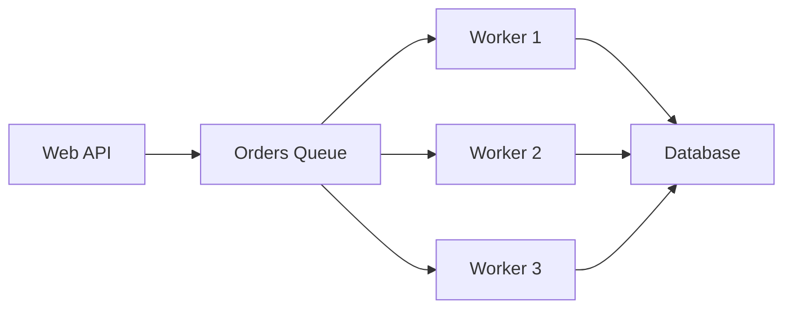
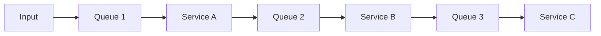
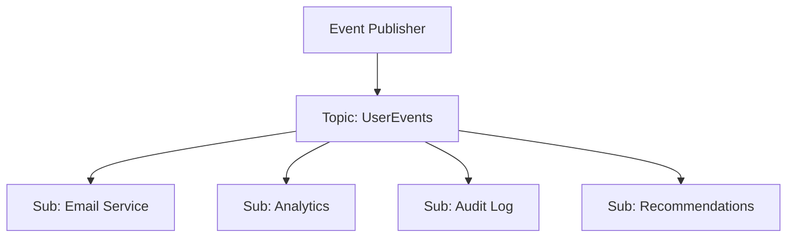
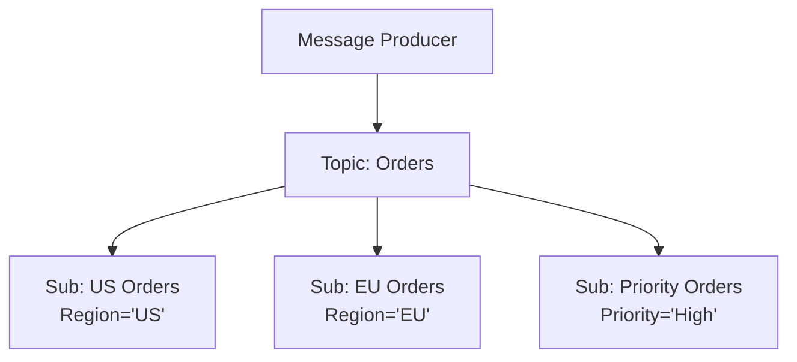
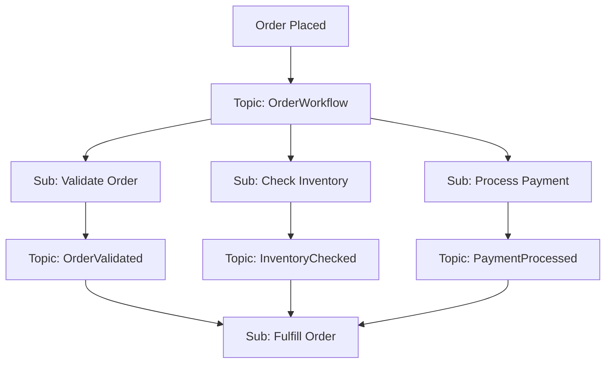

# Azure Service Bus: Queue vs Topic Usage Guide

This guide provides detailed recommendations on when to use **Queues** vs **Topics** in Azure Service Bus, with practical scenarios, patterns, and decision criteria.

---

## 1. Quick Decision Matrix

| Scenario | Use Queue | Use Topic | Reason |
|----------|-----------|-----------|---------|
| Single consumer type | ✅ | ❌ | Simple point-to-point messaging |
| Multiple consumer types | ❌ | ✅ | Need multiple independent subscriptions |
| Load balancing workers | ✅ | ❌ | Competing consumers for same message |
| Event broadcasting | ❌ | ✅ | Multiple subscribers need same message |
| Message filtering needed | Limited | ✅ | Subscription rules and filters |
| Simple request processing | ✅ | ❌ | Direct work queue pattern |
| Complex routing | ❌ | ✅ | Route to different services based on content |
| Single responsibility | ✅ | ❌ | One service handles all messages |
| Multiple responsibilities | ❌ | ✅ | Different services handle different aspects |

---

## 2. Detailed Usage Patterns

### 2.1 When to Use Queues

#### ✅ **Perfect for Queues:**

**1. Work Queue Pattern (Competing Consumers)**
```
Producer → Queue → [Worker1, Worker2, Worker3]
                   (only one worker gets each message)
```

**Use Cases:**
- Order processing where any available worker can handle any order
- Image resizing tasks
- Email sending jobs
- Background data processing
- Batch job distribution

**Example Scenario:**
```
E-commerce Order Processing:
- Orders come in from web API
- Multiple order processors compete for messages
- Each order is processed exactly once
- Failed orders go to DLQ for manual review
```

**2. Simple Request-Response**
```
Client → Request Queue → Service → Response Queue → Client
```

**Use Cases:**
- Microservice communication
- Async API calls
- Long-running operations
- Task delegation

**3. Load Leveling**
```
Bursty Producer → Queue (buffer) → Steady Consumer
```

**Use Cases:**
- Smoothing traffic spikes
- Decoupling fast producers from slow consumers
- Peak load management

#### ❌ **Avoid Queues When:**
- Multiple different services need the same message
- You need message filtering/routing
- Different processing logic needed for same message type
- Fan-out scenarios

### 2.2 When to Use Topics

#### ✅ **Perfect for Topics:**

**1. Event Broadcasting (Pub/Sub)**
```
Publisher → Topic → [Subscription1, Subscription2, Subscription3]
                    (each subscription gets copy of message)
```

**Use Cases:**
- Order placed → notify inventory, billing, shipping
- User registered → send welcome email, create profile, log analytics
- File uploaded → scan for viruses, generate thumbnails, index content
- System events → logging, monitoring, alerting

**Example Scenario:**
```
E-commerce Order Events:
Topic: "OrderEvents"
├── Subscription: "inventory-service" (updates stock)
├── Subscription: "billing-service" (processes payment)
├── Subscription: "shipping-service" (arranges delivery)
└── Subscription: "analytics-service" (tracks metrics)
```

**2. Message Routing with Filters**
```
Publisher → Topic → Subscription1 (Priority=High)
                  → Subscription2 (Region=US)
                  → Subscription3 (ProductType=Electronics)
```

**Use Cases:**
- Route messages based on properties
- Different processing for different message types
- Geographic or tenant-based routing
- Priority-based processing

**Example Filters:**
```sql
-- High priority orders
Priority = 'High'

-- Regional processing
Region IN ('US', 'Canada')

-- Product category routing
ProductCategory = 'Electronics' AND Price > 1000

-- Custom properties
sys.Label = 'urgent' OR CustomerTier = 'premium'
```

**3. Multi-Step Workflows**
```
Order Topic → [OrderValidation, PaymentProcessing, InventoryCheck]
              ↓
Result Topic → [OrderFulfillment, CustomerNotification]
```

**Use Cases:**
- Complex business processes
- Saga patterns
- Event choreography
- Microservice orchestration

#### ❌ **Avoid Topics When:**
- Only one consumer type exists
- Simple work distribution is needed
- No filtering or routing required
- Performance is critical (topics have slight overhead)

---

## 3. Architecture Patterns

### 3.1 Queue Patterns

#### **Pattern 1: Simple Work Queue**


**When to use:**
- Homogeneous processing
- Load balancing required
- Simple scaling by adding workers

#### **Pattern 2: Chain of Queues**


**When to use:**
- Sequential processing stages
- Different services handle different steps
- Error isolation between stages

### 3.2 Topic Patterns

#### **Pattern 1: Event Fan-out**


**When to use:**
- Single event, multiple reactions
- Loosely coupled services
- Event-driven architecture

#### **Pattern 2: Content-Based Routing**


**When to use:**
- Message routing based on content
- Regional processing
- Priority or category-based handling

#### **Pattern 3: Workflow Orchestration**


**When to use:**
- Complex multi-step processes
- Parallel processing steps
- Event choreography

---

## 4. Performance Considerations

### 4.1 Queue Performance

**Advantages:**
- Lower latency (direct routing)
- Higher throughput for single consumer type
- Simpler message flow

**Limitations:**
- Single point of consumption
- Limited routing flexibility

**Optimization Tips:**
```csharp
// Increase concurrent processing
var processorOptions = new ServiceBusProcessorOptions()
{
    MaxConcurrentCalls = 10,
    PrefetchCount = 50,
    AutoCompleteMessages = false
};

// Use sessions for ordered processing
var sessionProcessor = client.CreateSessionProcessor(queueName);
```

### 4.2 Topic Performance

**Advantages:**
- Parallel processing by multiple subscribers
- Flexible routing
- Decoupled consumers

**Limitations:**
- Higher latency (routing overhead)
- More complex message flow
- Resource overhead for multiple subscriptions

**Optimization Tips:**
```csharp
// Optimize subscription filters
// Good: Simple property comparison
"Priority = 'High'"

// Avoid: Complex computations
"SQRT(Price * Quantity) > 100"

// Use correlation filters when possible (more efficient)
var filter = new CorrelationRuleFilter()
{
    Subject = "HighPriority",
    Properties = { { "Region", "US" } }
};
```

---

## 5. Real-World Scenarios

### 5.1 E-commerce Platform

#### **Scenario A: Order Processing (Use Queue)**
```
Requirement: Process incoming orders efficiently
Challenge: Handle varying order volumes
Solution: Queue with competing consumers

Architecture:
Web API → OrderProcessing Queue → [OrderWorker1, OrderWorker2, OrderWorker3]
                                  ↓
                                Database
```

**Why Queue:**
- All orders need same processing
- Load balancing across workers
- Simple scaling by adding workers

#### **Scenario B: Order Events (Use Topic)**
```
Requirement: Notify multiple services when order placed
Challenge: Different services need different actions
Solution: Topic with filtered subscriptions

Architecture:
OrderService → OrderEvents Topic → Inventory (stock check)
                                 → Billing (payment)
                                 → Shipping (arrange delivery)
                                 → Analytics (metrics)
                                 → Notifications (customer email)
```

**Why Topic:**
- Multiple different consumers
- Each service handles different aspect
- Easy to add new services

### 5.2 IoT Data Processing

#### **Scenario A: Telemetry Processing (Use Queue)**
```
Requirement: Process sensor data efficiently
Challenge: High volume, homogeneous processing
Solution: Queue with auto-scaling workers

Architecture:
IoT Hub → TelemetryQueue → [DataProcessor1, DataProcessor2, DataProcessor3]
                          ↓
                        Time Series DB
```

**Why Queue:**
- Same processing for all telemetry
- Need load balancing
- Simple worker scaling

#### **Scenario B: Alert Processing (Use Topic)**
```
Requirement: Handle different types of alerts differently
Challenge: Route alerts based on severity and type
Solution: Topic with filtered subscriptions

Architecture:
AlertGenerator → AlertTopic → CriticalAlerts (Priority='Critical')
                            → WarningAlerts (Priority='Warning')
                            → SecurityAlerts (Type='Security')
                            → RegionalAlerts (Region='US')
```

**Why Topic:**
- Different handling per alert type
- Content-based routing needed
- Multiple alert handling services

### 5.3 Document Management System

#### **Scenario A: Document Processing (Use Queue)**
```
Requirement: Process uploaded documents
Challenge: CPU-intensive operations
Solution: Queue with specialized workers

Architecture:
Upload API → DocumentQueue → [PDFProcessor, ImageProcessor, TextProcessor]
                            ↓
                          Storage + Index
```

**Why Queue:**
- Similar processing workflow
- Resource-intensive operations
- Worker specialization by document type

#### **Scenario B: Document Events (Use Topic)**
```
Requirement: React to document lifecycle events
Challenge: Multiple systems need to know about document changes
Solution: Topic for event broadcasting

Architecture:
DocumentService → DocumentEvents → VirusScan (scan new documents)
                                 → Indexing (search indexing)
                                 → Backup (archive documents)
                                 → Audit (compliance logging)
                                 → Notifications (user alerts)
```

**Why Topic:**
- Multiple systems react to events
- Different reactions per event
- Event-driven architecture

---

## 6. Migration and Hybrid Patterns

### 6.1 Queue to Topic Migration

**When to migrate:**
- Need to add new consumer types
- Require message filtering
- Want event-driven architecture

**Migration Strategy:**
```
Phase 1: Topic + Default Subscription (mirrors queue behavior)
Phase 2: Add specific subscriptions
Phase 3: Remove default subscription
Phase 4: Optimize filters and subscriptions
```

### 6.2 Hybrid Patterns

#### **Pattern 1: Queue → Topic Chain**
```
Input Queue → Processing Service → Events Topic → Multiple Subscribers
```

**Use when:**
- Need both load balancing and event broadcasting
- Processing stage + notification stage

#### **Pattern 2: Topic → Queue Fan-out**
```
Events Topic → Multiple Subscriptions → Individual Queues → Specialized Workers
```

**Use when:**
- Event routing + load balancing per service
- Different scaling needs per consumer type

---

## 7. Best Practices Summary

### 7.1 Choose Queue When:
- ✅ Single type of consumer
- ✅ Need load balancing/competing consumers
- ✅ Simple point-to-point messaging
- ✅ Performance is critical
- ✅ Straightforward work distribution

### 7.2 Choose Topic When:
- ✅ Multiple different consumers
- ✅ Need message filtering/routing
- ✅ Event broadcasting required
- ✅ Loosely coupled architecture
- ✅ Content-based message routing

### 7.3 Common Anti-patterns:
- ❌ Using queues when multiple services need same message
- ❌ Using topics when only one consumer exists
- ❌ Over-complex subscription filters
- ❌ Not considering message ordering requirements
- ❌ Ignoring error handling and DLQ strategies

### 7.4 Decision Checklist:
1. **How many different types of consumers?** One → Queue, Multiple → Topic
2. **Do consumers need the same message?** Yes → Topic, No → Queue
3. **Need message filtering?** Yes → Topic, No → Queue
4. **Need load balancing workers?** Yes → Queue, No → Topic
5. **Event-driven architecture?** Yes → Topic, No → Queue

---

## 8. Code Examples

### 8.1 Queue Implementation

```csharp
// Producer
var sender = client.CreateSender("order-processing-queue");
await sender.SendMessageAsync(new ServiceBusMessage(orderJson));

// Consumer (competing workers)
var processor = client.CreateProcessor("order-processing-queue");
processor.ProcessMessageAsync += async args =>
{
    var order = JsonSerializer.Deserialize<Order>(args.Message.Body);
    await ProcessOrder(order);
    await args.CompleteMessageAsync(args.Message);
};
await processor.StartProcessingAsync();
```

### 8.2 Topic Implementation

```csharp
// Producer
var sender = client.CreateSender("order-events");
var message = new ServiceBusMessage(orderJson)
{
    Subject = "OrderPlaced",
    ApplicationProperties = 
    {
        ["Region"] = "US",
        ["Priority"] = "High",
        ["ProductCategory"] = "Electronics"
    }
};
await sender.SendMessageAsync(message);

// Consumer (subscription-specific)
var processor = client.CreateProcessor("order-events", "inventory-subscription");
processor.ProcessMessageAsync += async args =>
{
    var order = JsonSerializer.Deserialize<Order>(args.Message.Body);
    await UpdateInventory(order);
    await args.CompleteMessageAsync(args.Message);
};
await processor.StartProcessingAsync();
```

### 8.3 Subscription Filters

```csharp
// Create subscription with SQL filter
var rule = new CreateRuleOptions("HighPriorityUSOrders", new SqlRuleFilter("Priority = 'High' AND Region = 'US'"));
await adminClient.CreateRuleAsync("order-events", "priority-subscription", rule);

// Create subscription with correlation filter (more efficient)
var correlationFilter = new CorrelationRuleFilter()
{
    Subject = "OrderPlaced",
    Properties = { ["Priority"] = "High", ["Region"] = "US" }
};
var correlationRule = new CreateRuleOptions("HighPriorityUSOrders", correlationFilter);
await adminClient.CreateRuleAsync("order-events", "priority-subscription", correlationRule);
```

---

## 9. Monitoring and Observability

### 9.1 Queue Metrics
- **Active Messages**: Messages waiting to be processed
- **Dead Letter Messages**: Failed messages
- **Message Rate**: Messages per second
- **Consumer Count**: Active receivers

### 9.2 Topic Metrics
- **Active Messages per Subscription**: Backlog per subscriber
- **Subscription Count**: Number of active subscriptions
- **Message Fanout**: Average subscriptions per message
- **Filter Efficiency**: Messages filtered vs processed

### 9.3 Key Alerts
```
Queue Alerts:
- Active messages > threshold (backlog)
- Dead letter messages > 0 (failures)
- No active consumers (service down)

Topic Alerts:
- Subscription backlog > threshold
- Subscription inactive > time limit
- Filter match rate < expected (misconfigured filters)
```

---

This comprehensive guide should help you make informed decisions about when to use queues vs topics in Azure Service Bus based on your specific use case, architecture needs, and performance requirements.