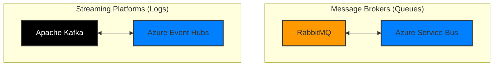

# RabbitMQ vs Azure Service Bus vs Kafka
## Understanding Where RabbitMQ Fits

---

## 1. The Short Answer
**RabbitMQ is most like Azure Service Bus.**

Both RabbitMQ and Azure Service Bus are **"Traditional Message Brokers"**. They focus on complex routing, message guarantees, and individual message processing.

**Kafka (and Azure Event Hubs)** is a **"Distributed Streaming Platform"**. It focuses on high-throughput, log-based storage, and processing streams of data.

| Feature | RabbitMQ | Azure Service Bus | Kafka / Event Hubs |
| :--- | :--- | :--- | :--- |
| **Category** | Message Broker | Message Broker | Event Streaming |
| **Primary Model** | Queue (Push) | Queue (Pull/Push) | Log (Pull) |
| **Message State** | Destructive Read (Gone after ack) | Destructive Read (Gone after complete) | Non-Destructive (Retained) |
| **Best For** | Complex routing, on-prem, multi-protocol | Azure-native enterprise messaging | High-scale telemetry & streaming |

---

## 2. RabbitMQ vs. Azure Service Bus (The Real Comparison)

Since these two are the direct competitors, here is how they differ.

### 2.1 Architecture
*   **RabbitMQ (Exchange Model):** You publish to an "Exchange", which routes to "Queues" based on "Bindings". It is very flexible for complex routing logic inside the broker.
*   **Service Bus (Topic Model):** You publish to a "Topic", and "Subscriptions" capture messages based on "SQL Filters".

### 2.2 Hosting & Operations
*   **RabbitMQ:** Usually **Infrastructure-as-a-Service (IaaS)**. You install it on VMs, manage clusters, handle patching, and scale it yourself. (Though managed versions exist).
*   **Service Bus:** **Platform-as-a-Service (PaaS)**. Serverless. You don't see the servers. Microsoft handles scaling, patching, and high availability.

### 2.3 Protocols
*   **RabbitMQ:** Native AMQP 0.9.1 (very chatty, feature-rich). Also supports MQTT, STOMP.
*   **Service Bus:** Native AMQP 1.0 (ISO standard, reliable). Also supports HTTP/REST.

---

## 3. RabbitMQ vs. Kafka (The Architectural Clash)

Comparing RabbitMQ to Kafka is comparing a **Mailman** to a **News Feed**.

### 3.1 The "Smart Broker" vs "Smart Consumer"
*   **RabbitMQ (Smart Broker):** The broker decides who gets what. It tracks delivery state. It pushes messages to consumers. It works hard.
    *   *Result:* Lower throughput, higher latency if broker is stressed.
*   **Kafka (Smart Consumer):** The broker is just a fast storage log. The consumer decides what to read and tracks its own offset.
    *   *Result:* Massive throughput, very low burden on the broker.

### 3.2 Message Lifecycle
*   **RabbitMQ:** Messages are transient. Once a consumer acknowledges a message, it is **deleted** from memory/disk.
*   **Kafka:** Messages are durable logs. They stay on disk for days/weeks. Consumers can **replay** old messages.

---

## 4. Decision Matrix: When to use RabbitMQ?

Use **RabbitMQ** if:
1.  **You are On-Premises:** It is the industry standard for self-hosted messaging.
2.  **Complex Routing:** You need very specific routing logic (Headers exchanges, Topic exchanges) that Service Bus filters might not cover (though Service Bus is catching up).
3.  **Legacy Protocols:** You need AMQP 0.9.1 or STOMP support.
4.  **Cloud Agnostic:** You want to run the exact same code on AWS, Azure, and your laptop without changing the broker.

Use **Azure Service Bus** if:
1.  **You are on Azure:** It is the native, fully managed choice. Zero maintenance.
2.  **Transaction Support:** You need robust distributed transactions.
3.  **Hybrid Connectivity:** You need features like Azure Relay or seamless integration with Logic Apps/Functions.

Use **Kafka / Event Hubs** if:
1.  **Scale:** You have > 1 million events per second.
2.  **History:** You need to replay events (e.g., "Reprocess yesterday's data").
3.  **Stream Processing:** You are doing real-time analytics (Windowing, Aggregation).

---

## 5. Summary Diagram

