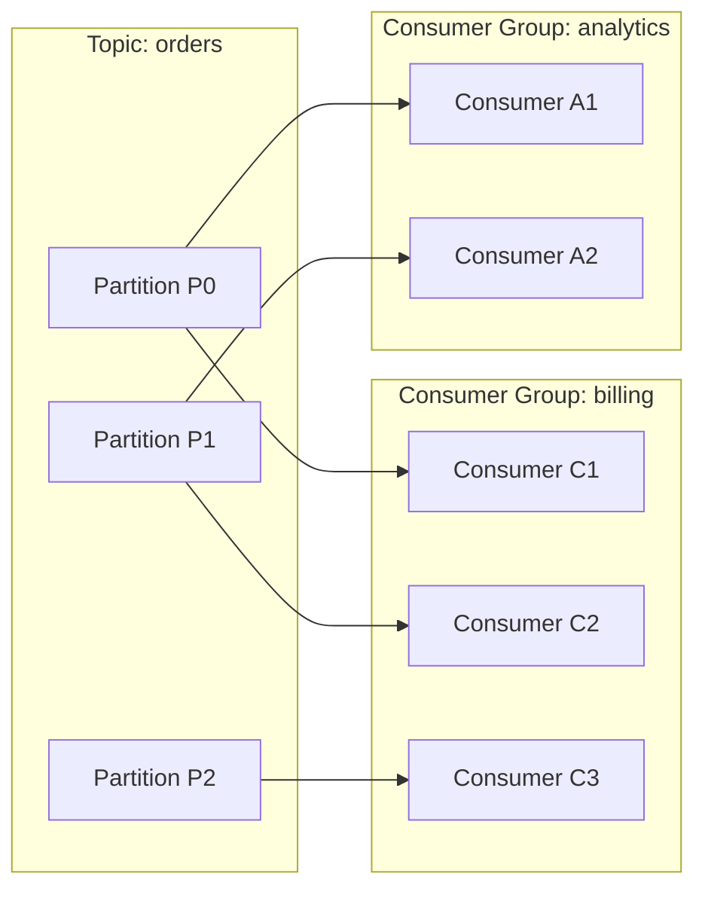

# Azure Service Bus vs Apache Kafka — Focused Comparison

This document compares **Azure Service Bus** and **Apache Kafka**, with a focus on: Queues, Topics, Partitions, and Push vs Pull models. This is intended to clarify how each system treats fundamental messaging concepts and the implications for ordering, scaling, delivery semantics, and architecture.

---

## 1. High-level differences (one-liner)
- **Service Bus**: Brokered messaging service for enterprise messaging patterns — queues (point-to-point) and topics/subscriptions (publish/subscribe). Typically used for reliable, transactional messaging, workflows, and complex routing.
- **Kafka**: Distributed event streaming platform — topic+partition model for very high-throughput streaming and event sourcing with replay and consumer-driven scaling.

---

## 2. Core Concepts

### 2.1 Queue (Service Bus) vs Topic (Kafka & Service Bus)
- **Azure Service Bus - Queue**
  - Point-to-point messaging: one message is consumed by one receiver.
  - Multiple competing consumers may read from the same queue; the broker dispatches each message to a single active consumer.
  - Supports FIFO-like ordering per message session, or per partition in a partitioned queue — but global ordering isn't guaranteed when partitioned.
  - Features: Peek-Lock (receive and defer acknowledgment), Dead-lettering, Sessions for ordered processing and correlation, Transactions, Duplicate Detection.

- **Azure Service Bus - Topic (with subscriptions)**
  - Publish/Subscribe (one message delivered to multiple subscriptions).
  - Each subscription acts like a durable virtual queue that receives a copy of messages.
  - Subscriptions can have filters/rules so subscribers get only relevant messages.
  - Ordering per subscription can be achieved with sessions (message session id correlates messages for a single consumer order). Partitioned topics are possible for scale.

- **Apache Kafka - Topic**
  - Topics are partitioned logs (one topic may have many partitions).
  - Each partition is an ordered, immutable sequence of messages with offset values.
  - Consumers in the same consumer group each own a subset of partitions (exclusive consumption per partition per group).
  - Multiple consumer groups can independently read the same topic (each has its own offsets and replay capability).


### 2.2 Partition semantics & ordering
- **Service Bus Partitions**
  - Service Bus lets you enable partitioning on queues and topics to increase throughput and availability.
  - Partitioning hides the internal distribution across multiple message brokers; it's transparent to users.
  - Partitioned Service Bus entities do not guarantee cross-partition ordering; ordering is only guaranteed within a session or with a consistent partition key.
  - Sessions (or session ID) is the recommended mechanism when you need **FIFO** ordering for message groups.

- **Kafka Partitions**
  - Partitions are a first-class, explicit unit of parallelism and ordering.
  - Ordering is guaranteed only within a partition. If ordering of related messages must be maintained, they must be written to the same partition via a partition key.
  - Consumer groups coordinate partition assignment; each partition is consumed by only one consumer in a group at a time.
  - Partitions map directly to brokers and storage; developers/operators control the number of partitions.

---

## 3. Push vs Pull models (how consumers receive messages)

### Apache Kafka — Pull Model (Default)
- Consumers actively pull (poll) messages from Kafka partitions at their own pace.
- Advantages:
  - Back-pressure control: consumers read at a pace they can process.
  - Exactly where the consumer is reading is explicit (offsets) and allows reliable replay.
  - Easy to scale consumer groups by adding consumers; partitions determine parallelism.
- Implications:
  - Client manages offsets (or commits offsets) to track read/processed messages.
  - The broker retains messages for configured retention, enabling replay.

### Azure Service Bus — Push and Pull (Broker-dispatch & explicit Receive)
- Service Bus supports multiple receive modes and behaviors:
  - **Receiver-based (explicit pull API)**: You call `Receive` or `ReceiveBatch` to pull messages from the queue or subscription.
  - **Push-style with message handlers**: SDKs provide `RegisterMessageHandler`/`MessageProcessor` which open a link and the service delivers messages over the established connection.
- Advantages:
  - Push-like handlers simplify building event-driven processors; the service helps deliver messages to the registered handler.
  - Pull APIs let consumers control throughput and integrate backpressure logic.
- Implications:
  - Service Bus tracks delivery via lock tokens (peek-lock) and requires explicit `Complete`/`Abandon` calls for message lifecycle.
  - Durable subscriptions (topics) keep message copies even when consumers disconnect.

**Bottom line:** Kafka is naturally consumer-pull; Service Bus supports both push-like handlers and pull receive modes — the typical user experience is push-like due to SDK handlers.

---

## 4. Delivery, semantics, and guarantees
- **Service Bus**
  - Delivery: At-least-once (default) — a message may be delivered more than once. Use duplicate detection (via `MessageId` and window) or idempotent processing to handle duplicates.
  - Ordering: Session ID or consistent partition key (for partitioned entities) provide ordering guarantees for a message group; otherwise order is not guaranteed across partitions.
  - Transactions: Supports AMQP transactions across messages, send/receive/complete operations, and operations targeting multiple entities in **some** scenarios.
  - Dead-letter queue: Built-in DLQ for messages that cannot be processed (e.g., max delivery count exceeded).

- **Kafka**
  - Delivery: At-least-once by default since consumers poll and commit offsets after processing; exactly-once semantics are possible with idempotent/transactional producers and careful consumer coordination.
  - Ordering: Per-partition ordering guaranteed; use partition keys to ensure related messages go to the same partition.
  - Transactions: Kafka supports transactions and idempotent producers to allow atomic writes across partitions for pattern implementations.
  - Replay: Consumers can rewind to any earlier offset to reprocess messages; retention controls how long messages are kept.

---

## 5. Subscription / Consumer Group comparison
- **Service Bus Subscriptions**
  - Each subscription is a separate durable queue that stores copies of messages from the topic and can be independently consumed.
  - Each subscription has its own set of receivers; multiple receivers scale by competing for messages in the same subscription.
  - Subscriptions can define filters and rules (message properties-based routing) so different subscriptions get different subsets.

- **Kafka Consumer Groups**
  - Consumer group membership determines who receives which partitions: partition assignments are distributed among active consumers.
  - Each consumer group represents a logical independent subscriber with its own offsets; many consumer groups can read the same topic concurrently.
  - Filtering usually happens client-side or via Kafka Connect/Streams; Kafka doesn’t have a first-class server-side subscription filter mechanism like Service Bus.

---

## 6. When to use which? (Scenarios)

- Use **Azure Service Bus** when:
  - You need enterprise messaging capabilities like queues, advanced routing with topic filters, sessions, or transactions.
  - Your workflow requires durable subscriptions, dead-lettering, and message lock/settlement semantics.
  - Your application needs strong integration with Azure PaaS services (Logic Apps, Functions, etc.) and low operational overhead.
  - You want push-style message delivery to consumers via handlers.

- Use **Apache Kafka** when:
  - You need high-throughput event streaming with retention and replay across consumer groups.
  - Ordering per partition and log-based event sourcing are key concerns.
  - You want fine-grained control of partitions and vertical/horizontal scaling.
  - You need the Kafka ecosystem (Streams, Connect, Confluent tooling) and multi-cloud or self-managed deployments.

---

## 7. Practical notes & gotchas
- Ordering: If you have a strong ordering requirement for related messages, both systems can satisfy this — Service Bus via **sessions** and Kafka via **partition key** targeting the same partition.
- Scaling: Kafka partitions are explicit and must be planned; Service Bus partitions can be toggled and are more managed but with less granular control.
- Message retention: Kafka retains messages for a configured retention period (or by size), while Service Bus retains until delivery or TTL, and retains a copy based on subscription/queue configuration.
- Exactly-once: Kafka can provide exactly-once semantics with transactional producers; Service Bus doesn’t natively provide exactly-once but has duplicate-detection to reduce duplicates and transactional capabilities for safe processing patterns.
- Resource and operations: Service Bus is a cloud-managed broker and easier to operate. Kafka provides more flexibility and features but has operational complexity.

---

## 8. Examples (simple flows)

### 8.1 Service Bus Queue (point-to-point)
- Producer sends message to `queue://orders`.
- Broker stores message.
- Consumers C1, C2 compete to get messages from the queue.
  - Broker dispatches a message to C1.
  - C1 uses PeekLock and after processing calls `Complete`.
  - If C1 fails, it can `Abandon`, and the message returns to the queue for redelivery (dead-lettered after max attempts).

### 8.2 Service Bus Topic + Subscriptions (pub/sub)
- Producer sends to `topic://orders`.
- Subscription S1 (for billing) and S2 (for shipping) each receive copies.
- Each subscription has its own receivers and can filter messages with a rule (e.g., `label = 'shipping'`).

### 8.3 Kafka Topic+Partition
- Producer appends messages to `topic: orders` with a partition key (e.g., `customerId`).
- Kafka writes messages to partitions (e.g., partition 0, 1).
- Consumer Group `billing` has 3 consumers; each consumer gets ownership of some partitions.
- Consumers poll, process messages, and commit offsets.
- Rewind: Consumer can seek to prior offsets for replay, enabling reprocessing.

---

## 9. Quick comparison table
| Aspect | Service Bus | Kafka |
|--------|-------------|-------|
| Primary model | Brokered queueing & pub/sub (topics & subscriptions) | Partitioned append-only log (topic/partition) |
| Consumer style | Push handlers + pull-based Receive API | Pull (consumer-driven) |
| Ordering unit | Session (or partition for partitioned entities) | Partition |
| Multi-subscriber | Topic+subscriptions (server-side copies & filters) | Multiple consumer groups (client-side) |
| Scaling control | Managed partitions, scale through throughput | Explicit partitions + more operator control |
| Message ownership | Message lock, explicit Complete/Abandon | Offset commit per consumer group |
| Replay | Limited to retention/TTL (subscriptions keep messages) | Native replay via offsets and retention |
| Transactions | AMQP transactions, supports cross-entity operations | Producer & transactional guarantees available |

### Diagram: Consumer group -> Partition mapping (queue-like behavior)
Below is a Mermaid diagram illustrating how a Kafka topic with partitions maps to consumers in a consumer group — the basis for queue-like competing-consumer behavior.



Explanation:
- Each partition is assigned to a single consumer within the same consumer group; for example P0->C1, P1->C2, P2->C3 in a 3-partition topic with 3 consumers.
- If there are fewer consumers than partitions, some consumers will own multiple partitions; if there are more consumers than partitions, some consumers will be idle.
- Messages in a partition are delivered to the single assigned consumer in the group, so the group as a whole consumes each message exactly once (per group), providing queue-like behavior for that group.

You can also have multiple consumer groups (e.g., `billing` and `analytics`), where each group independently reads the topic and processes messages at its own pace (pub/sub behavior).

---

## 10. Summary
- Service Bus is aimed at robust enterprise messaging patterns: reliable delivery, complex routing, sessions, and push-style handlers. Good fit for business workflows, enterprise integration, and Azure-native serverless hubs.
- Kafka is a general-purpose event streaming platform for high-throughput, long-term retention and replay, and stream processing. Use Kafka for telemetry, event sourcing, and when you need deep control over partitions and consumer scaling.

---

If you'd like, I can also:
- Add diagrams or diagrams-as-markdown for each flow (queues, topics+subs, partitions).
- Provide quick code snippets for push-style and pull-style consumers in Service Bus and Kafka (Node/Python/C#).
- Cross-link to `azure_event_services_full_doc.md` and `eventhubs_vs_kafka_comparison.md` for a broader Azure comparison.

---

## 11. Scenario mapping: Best-fit examples
Below are common scenarios mapped to whether **Service Bus**, **Kafka**, or **Both** are the better fit. Each scenario includes a short rationale tied to queue/topic/partition and push/pull concerns.

### 11.1 Best for Azure Service Bus
- **Command-and-control / transactional workflows (order processing, inventory updates)** — Use queues or topics with sessions to ensure ordered handling per workflow and take advantage of broker-managed peek-lock and transactional semantics. Push-style handlers simplify integration with application logic and serverless functions.
- **Request-response (RPC) patterns** — The brokered model and request-reply capabilities (reply-to queues) make RPC-style messaging simpler and more natural on Service Bus.
- **Business workflows needing advanced routing or filtering** — Use topics with subscription rules and server-side filters to route messages to specific subscribers without client-side filtering.
- **Guaranteed single delivery to a single processor (competing consumers)** — Queues ensure that each message will be delivered to only one active consumer at a time.
- **Low-to-moderate throughput enterprise messaging** — When throughput requirements are moderate and operational simplicity / managed service matters, Service Bus is a strong choice.

### 11.2 Best for Apache Kafka
- **High-throughput telemetry (clickstreams, metrics, logs)** — Kafka’s partitioned topics and retention model support very large ingest volumes and efficient re-processing. The pull-based consumer model gives consumers granular control on throughput and offsets.
- **Event sourcing and audit logs** — The immutable log semantics and replay via offsets are a natural fit for event-sourced architectures where rehydrating state is required.
- **Stream processing & transformations at scale** — Kafka Streams or KSQL for in-cluster processing of high-volume streams is ideal for real-time analytics and derived views.
- **Large-scale multi-subscriber analytics pipelines** — Multiple independent consumer groups can read the same data without interfering; Kafka’s retention enables replay and reprocessing.
- **Exactly-once and idempotent production at scale** — Kafka provides transactional and idempotent producer capabilities suitable for strong correctness needs in complex streaming systems.

### 11.3 Good for Both (choose based on non-functional needs)
- **Fan-out to multiple consumers (pub/sub)** — Service Bus topics with subscriptions (server-side copies, filtering) or Kafka topics with multiple consumer groups (client-side filtering) both provide pub/sub semantics; choose Service Bus for server-side filtering or Kafka for high-throughput replayable logs.
- **Asynchronous decoupling for microservices** — Either system decouples producers and consumers; Service Bus provides simpler operations and enterprise features, Kafka provides retention and replay.
- **Buffering and smoothing spikes** — Both systems buffer bursts of messages. Kafka’s retention and log storage gives stronger reprocessing capability for bursts; Service Bus gives easier operational behavior for short-term buffering and retries.
- **Multi-service integration with differing consumer patterns** — If consumers are a mix of short-lived serverless functions and long-lived streaming processors, Service Bus might be simpler for serverless, Kafka often simplifies long-lived stream processing.

---

## 12. Short decision checklist
Use the checklist below to pick the more appropriate platform quickly:
1. Do you need high throughput, long retention, and replay? -> Kafka.
2. Do you need built-in server-side filtering, session-based ordering, or broker-triggered delivery for serverless integration? -> Service Bus.
3. Do you want explicit partitions under your control to maximize parallelism? -> Kafka.
4. Do you need low ops overhead and a managed PaaS broker for enterprise messaging patterns? -> Service Bus.
5. Need both (some subsystems prioritize replay/throughput, others need advanced broker features)? -> Consider a hybrid approach (Kafka for telemetry/analytics + Service Bus for workflows/commands) or managed cloud solutions that fit both needs.

---

**End of ServiceBus vs Kafka doc**

---

## 13. Does Kafka have a Queue model like Service Bus?
Kafka doesn't expose a first-class "Queue" object like Azure Service Bus. However, Kafka's combination of topics, partitions, and consumer groups provide queue-like behavior in practice.

### Key points
- **No broker-side Queue abstraction**: Service Bus separates Queues (single consumer per message) from Topics (multi-subscriber). Kafka has only Topics — queues are approximated by consumer groups.
- **Queue-like behavior via consumer groups**: When consumers share the same consumer group, Kafka treats each partition as being consumed by one consumer in the group at a time. That yields competing-consumer behavior: messages in a partition are processed by a single consumer in the group (queue-like semantics per partition).
- **Retention vs lifecycle**: Service Bus removes messages on successful completion, while Kafka retains messages for a configured retention period and consumers manage offsets to mark progress.
- **No peer lock / settlement**: Service Bus has peek-lock/Complete/Abandon/DeadLetter operations; Kafka lacks server-side locks and settlement semantics; consumers manage commits and implement retry/DLQ logic themselves.
- **Ordering semantics**: Kafka guarantees ordering only inside a partition; Service Bus supports ordering via sessions or single-partition entities.
- **Replay and offsets**: Kafka supports native replay by seeking to earlier offsets; Service Bus requires retention or other patterns for replay.

### Practical guidance: making Kafka act like a queue
- To implement queue behavior with Kafka, use a single consumer group for all consumers of a logical queue. The group will distribute partitions to consumers so each message is processed by a single group instance.
- Use partition keys for related messages when preserving ordering is required, or keep the topic single-partition for strict global order (with throughput tradeoff).
- Implement dead-lettering by publishing messages to a dedicated dead-letter topic after a configurable number of retries.
- Use manual offset commits after processing to ensure at-least-once processing semantics.

### Quick comparison table: Service Bus Queue vs Kafka (queue-like behavior)
| Feature | Service Bus Queue | Kafka (Topic + Consumer Group) |
|---|---:|---:|
| Queue abstraction | Yes, broker-managed queue | No, topic + consumer group emulate queue behavior |
| Message ownership & lock | Yes (peek-lock, lock token) | No server-side lock; consumer commits offsets |
| Message deletion | Broker deletes on Complete | Broker retains (retention); consumers track offsets |
| DLQ | Built-in DLQ per queue | Not built-in; implement via a dead-letter topic |
| Replay | Limited; typically not used for long-term replay | Native via offsets and retention (easy rewind) |
| Ordering | Session or single partition | Ordering guaranteed per-partition only |
| Consumer model | Broker push or pull | Consumer-driven pull (client polls) |

---

---

## Appendix — Short code snippets

### Service Bus: Example push-style (C# `ServiceBusProcessor`)
```csharp
var client = new ServiceBusClient(connectionString);
var processor = client.CreateProcessor(queueName, new ServiceBusProcessorOptions());

processor.ProcessMessageAsync += async args =>
{
    var body = args.Message.Body.ToString();
    // Business logic
    await args.CompleteMessageAsync(args.Message);
};

processor.ProcessErrorAsync += async args => { /* error handling */ };
await processor.StartProcessingAsync();
```

### Service Bus: Example pull-style (C# `Receiver`)
```csharp
var receiver = client.CreateReceiver(queueName);
ServiceBusReceivedMessage message = await receiver.ReceiveMessageAsync(TimeSpan.FromSeconds(10));
// Process message
await receiver.CompleteMessageAsync(message);
```

### Kafka: Consumer example (Node.js using kafkajs — consumer is "pull" under the hood)
```js
const { Kafka } = require('kafkajs');
const kafka = new Kafka({ clientId: 'app', brokers: ['kafka:9092'] });
const consumer = kafka.consumer({ groupId: 'billing' });
await consumer.connect();
await consumer.subscribe({ topic: 'orders', fromBeginning: false });
await consumer.run({
  eachMessage: async ({ topic, partition, message }) => {
    const body = message.value.toString();
    // process message
  }
});
```

These short examples should help illustrate how Service Bus exposes both push/hook-based and pull-based APIs, whereas Kafka exposes a consumer-driven (pull) pattern even when libraries provide convenient handlers.

---

## Key Takeaways
- Service Bus is broker-centric and feature-rich for enterprise messaging; it supports push and pull consumption modes and server-side filtering for subscriptions.
- Kafka is a distributed log optimized for high-throughput streaming and replay; it strongly emphasizes client-side control (pull) and explicit partitioning for scale and ordering.
- Use sessions in Service Bus for message-ordering needs; use partition keys in Kafka to co-locate related messages into the same partition.

---
