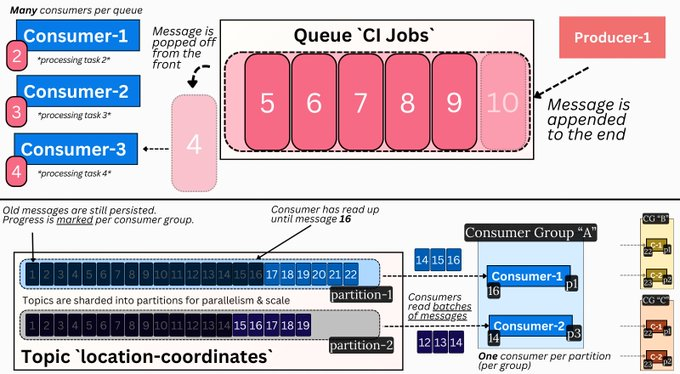

# Message Queues vs Pub-Sub

Most people don’t understand the difference between **Message Queues** and **Pub-Sub**.

They are different systems meant for different use cases powered by different data structures.

- **Pub-Sub systems** like Kafka are powered by the **Log** data structure.
- **Message Queues** like RabbitMQ and SQS are powered by... the **Queue**.

## Data Structures

### 🔶 The Queue
The Queue data structure is well known to most engineers. You append items to the end and pop items off of the front.

The key word is **pop** - once an item is popped, it no longer exists in the queue.

### 🔶 The Log
The Log data structure is similar - items are appended to the end. It is also read from front to end.

**The big difference?** Elements are **NOT** deleted once read.

This inherently enables **read-fanout** - the act of reading the same message multiple times. Since the same app doesn't need to read data twice, it's usually different apps that make use of the same message.

Both MQs and PubSub are used for asynchronous processing. But their technical differences lead them to optimize for different use cases.

---

## 🛑 Message Queues

Queues work **one item at a time**.

Consumers in these systems read one message, process it, mark it as processed, the message gets deleted forever and the consumer reads another one.

Queues are therefore meant for **point-to-point communication**. Only one destination gets to ever read and process that message.

This maps perfectly to the mental model of a "job" - a discrete unit of work that needs to get executed once and marked as complete.

Message Queues are therefore best suited for **long-running tasks** like:
*   Run a CI job (minutes to hours)
*   Generate a report (seconds)
*   Send an e-mail or notification (milliseconds)

Such jobs don’t have uniform processing times either. One CI job can take hours and another can take minutes.

Because of the long and unpredictable processing times, MQs enable **parallel processing** by allowing multiple readers to read from the same queue. 👌

This avoids **head-of-line blocking**. Otherwise a single slow CI job would block every subsequent one from getting processed in parallel. ⏳

This single-message processing means a Queue doesn't scale as much as a Log, but it can still easily handle thousands of jobs a second.

And that's ok - it doesn't need more. By not focusing on scalability at all costs, queues can provide a lot of rich functionality like payload routing, message TTLs, per-message priority, scheduled delivery, error handling and schema validation.

### Reliability
A common complaint about message queues is their propensity to crash and lose data.

Older MQ implementations stored messages exclusively in memory. This meant that they could run out of memory, crash and lose all the unprocessed data.

❌ Worse off, this flaw indirectly coupled producers to consumers. If your consumers were slow/broken, your queue would eventually crash. That lead to downtime in your producers too, because they couldn't write to the queue.

Newer message queues don't do this.

---

## 🛑 Pub-Sub

Log-based systems work with **many messages (batches)** at a time.

This is because in pub subs, messages usually represent **data points**, not tasks. They aren’t singular jobs that need processing but rather events which get processed in aggregate.

Examples include:
*   Process website IP visits and detect bots 🤖
*   Store website analytics data (clicks, views) and compute counts in real-time 📊
*   Detect video game cheating in real-time by analyzing the delta between character location data (are they using a speed hack?) 👾

A single event doesn’t have much value, but the collection of events in sequence do.

This is why Pub-Sub systems optimize for **scale** and **strict ordering**.

Events with the same key deterministically go to the same partition. **Head of line blocking exists here** - each partition is read by only one consumer. 👌

This makes stateful processing per entity dead-easy.

👉 **Example:** Take the video game cheat detection. If messages are keyed by user id, the consumer knows that it will see every event for that player in the order it was produced. This lets the consumer compute the location coordinate deltas properly.

### Features Unlocked by Logs
Log-based systems do not delete data once it’s read. This unlocks:
*   **Read fanout** - the same data used for cheat detection can be read for game analytics purposes.
*   **Replay** - the whole stream of data can be reprocessed from the beginning.

Replay is useful when you need to rebuild the latest state or re-process the data after fixing a bug which broke the way the consumer processed data.

### Fanout and Consumer Groups
As mentioned earlier, pub-sub systems allow read-fanout. LinkedIn originally created Kafka because they had multiple destinations per event.

Unlike point-to-point, this is a **one-to-many communication model**. One producer writes one piece of data that gets read by many consumers. 💡

Read fanout is handled by **consumer groups**. A single log (partition) is read from only one consumer at a time.

To achieve fanout and read the same partition multiple times, multiple consumer groups are created. Each group has its own consumer clients.

Consumers from different groups process the log independently. They read the exact same set of data but keep completely separate markers to denote the progress they've made in reading the log.

### Trade-offs
Log-based pub sub systems can scale massively. To achieve that, they sacrifice a lot of features.

Kafka most famously is implemented as a **dumb pipe** - the server is completely agnostic to what data is being sent to it.

It doesn't even support schemas on the server-side, not to mention things like message priority, re-ordering or schema validation.

This trades off a lot of usability for the ability to scale to many millions of messages a second. 👌

---

## 🛑 Summary

Both systems are similar in that they enable asynchronous processing of messages.

*   Certain use cases like **one-off task handling** is best done with **Message Queues**.
*   Other **higher-volume aggregation jobs** are best done with **Pub Sub**.

The most important thing is to not confuse both, and choose the right tool for the job.

